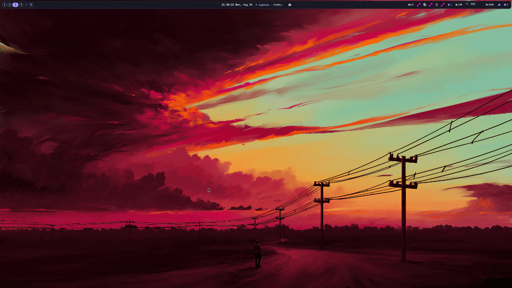
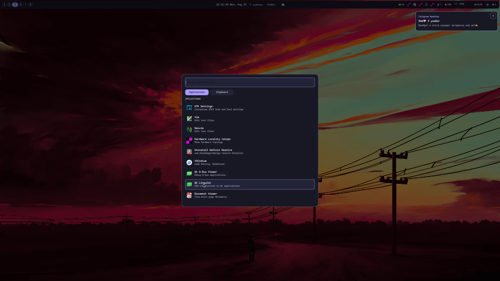
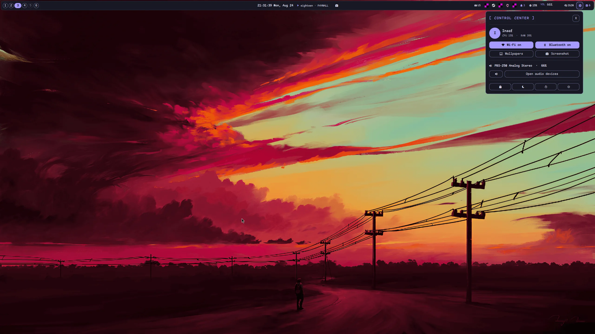
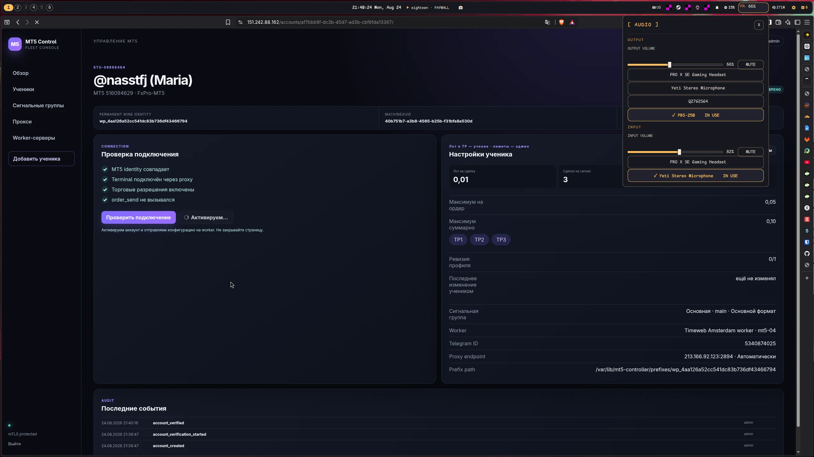
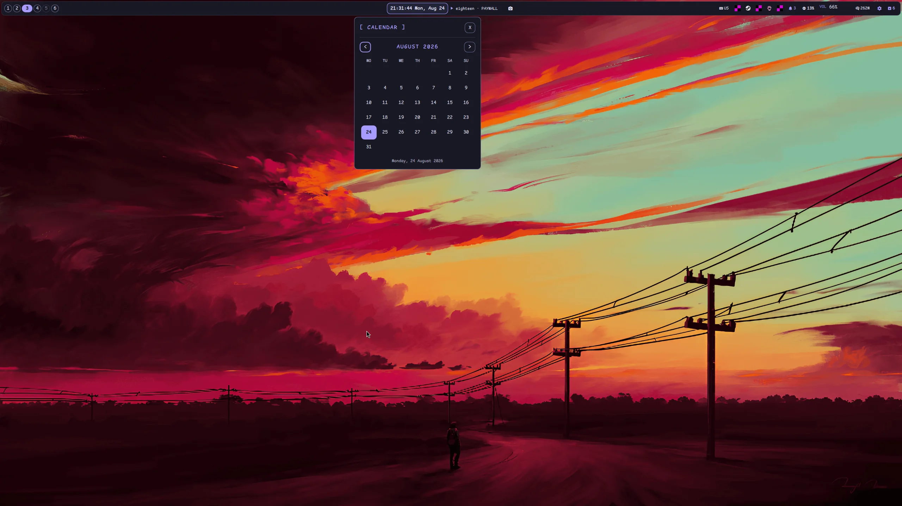
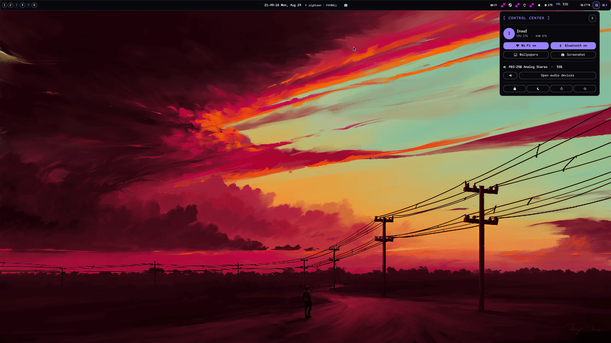
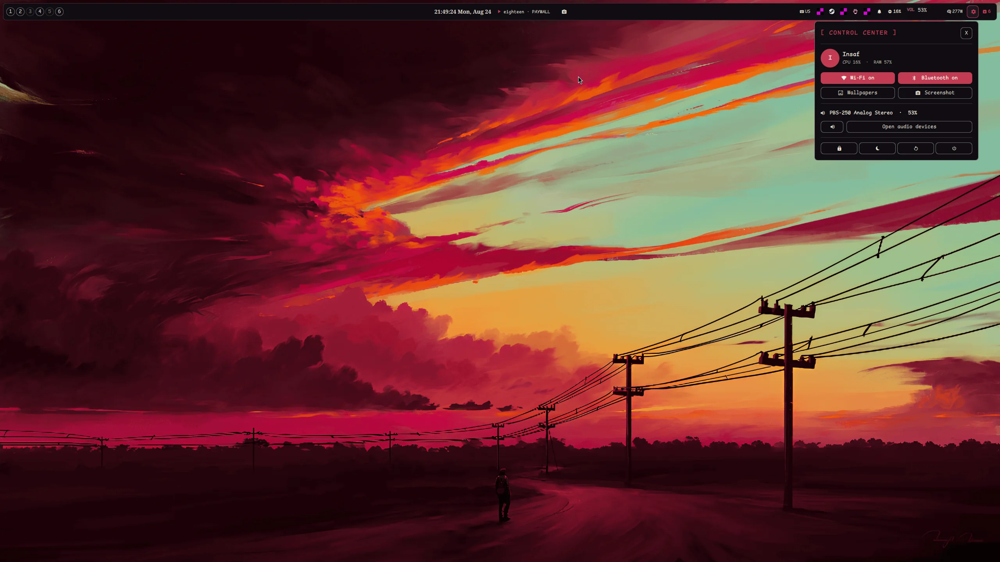

# Rashell

A personal Quickshell desktop shell for Hyprland, built around the controls used on this machine.

## Current shell

- Full-width framed bar with workspaces, current weather, clock, MPRIS media, screenshot, keyboard layout, system tray, Bluetooth, notifications, CPU, PipeWire volume, token usage, control center, and update status
- Searchable application launcher with clipboard history
- Notification daemon, popup, bounded history, and do-not-disturb mode
- PipeWire output/input controls with direct device selection and volume OSD
- Media panel with artwork, seek, and playback controls
- Control center with Wi-Fi, a Bluetooth device panel, wallpaper access, capture, audio, system status, lock, suspend, and confirmed power actions
- Wallpaper ownership, calendar, session controls, and Hyprland workspace switching
- Last-known-good JSON configuration reload
- Theme concepts from `rashell-themes.html`: `oilslick`, `muninn`, `nevermore`, and `talon`
- Legacy `ember`, `raven`, and `jade` themes remain available

The documents under [`docs/architecture`](docs/architecture/) describe the original minimal baseline. The current shell intentionally supersedes that boundary with a fixed set of first-party daily-use features.

## Screenshots

| Desktop | Launcher | Control center |
|---|---|---|
|  |  |  |

| Audio | Calendar |
|---|---|
|  |  |

### Themes

| Oil Slick | Muninn | Nevermore | Talon |
|---|---|---|---|
|  |  |  |  |

## Run and remove

```bash
just start       # select and start Rashell, stopping Noctalia
just stop        # stop Rashell and restore Noctalia V5
just uninstall   # restore Noctalia and remove the Quickshell symlink
just install     # recreate the safe Quickshell symlink
```

`just run`, `just noctalia`, and `just remove` are equivalent convenience recipes. The recipes use the compatible user-local Quickshell runtime by default; override it with `RASHELL_QUICKSHELL` when needed.

Rashell requires Quickshell 0.3.1 or newer, Hyprland, PipeWire, NetworkManager, BlueZ, `curl`, `jq`, `cliphist`, `grim`, `slurp`, `satty`, `wf-recorder`, and `wl-copy`. System-audio recording also requires `pactl`. The weather widget refreshes Celsius conditions from wttr.in every 30 minutes. Click it to open the animated conditions panel and choose a city; leave the city empty for automatic IP-based location. The token and update widgets use the existing local token-meter helper and `checkupdates`.

## Configuration

Edit `config.json` or provide an absolute path with `RASHELL_CONFIG`. `muninn` is the default old-gold identity.

```bash
just themes
just theme oilslick
just theme muninn
just theme nevermore
just theme talon
```

Theme changes hot-reload while Rashell is running. `ember`, `raven`, and `jade` remain accepted for compatibility. Set `captureDirectory` in `config.json` to choose where screenshots, edited screenshots, and videos are saved.

## IPC

```bash
quickshell -c rashell ipc call rashell launcherToggle
quickshell -c rashell ipc call rashell controlCenterToggle
quickshell -c rashell ipc call rashell bluetoothPanelToggle
quickshell -c rashell ipc call rashell audioPanelToggle
quickshell -c rashell ipc call rashell weatherPanelToggle
quickshell -c rashell ipc call rashell calendarPanelToggle
```

## Test

```bash
python -m unittest discover -s tests -p 'test_*.py' -v
tests/smoke.sh
```

Noctalia-derived interaction patterns are acknowledged in [`THIRD_PARTY_NOTICES.md`](THIRD_PARTY_NOTICES.md).
