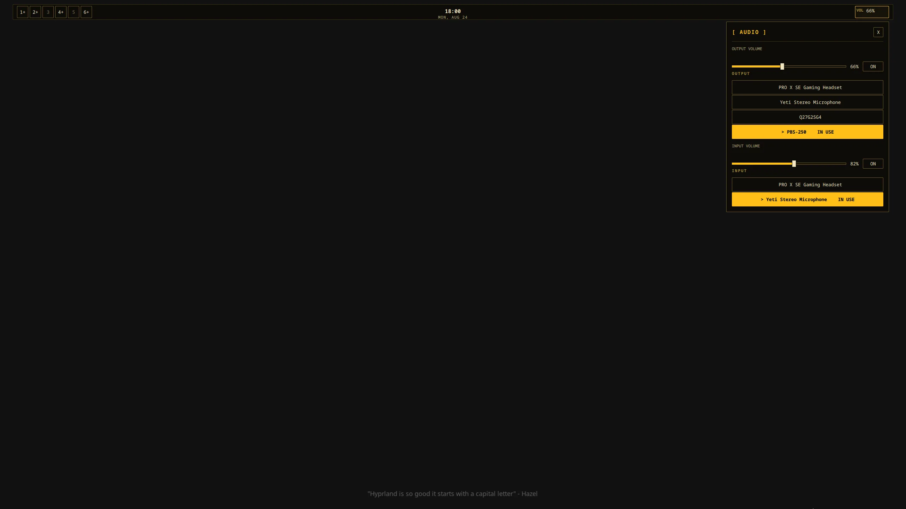
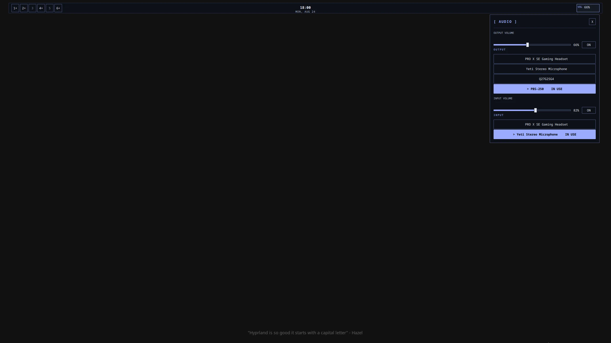
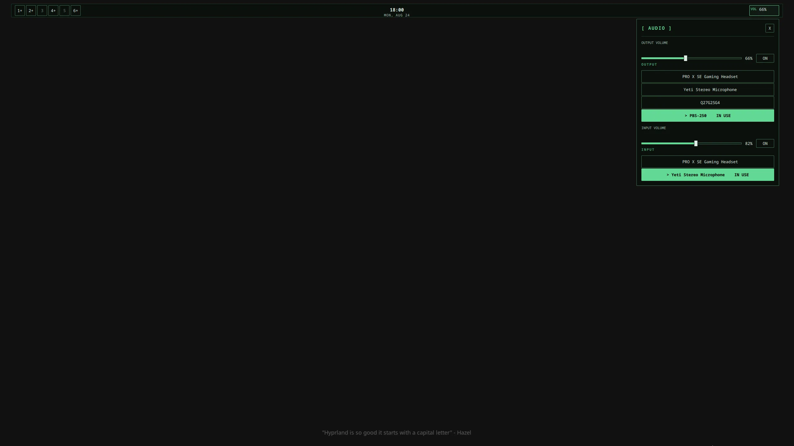

# Rashell

A personal Quickshell desktop shell inspired by ravens.

## First coherent version

- One three-zone bar per output
- Hyprland workspaces `1…6`
- Centered clock and month-reference calendar
- Shared PipeWire output/input controls with direct device selection
- One coordinated panel host
- Fixed IPC for panels and output audio
- Volume OSD and failure feedback overlay
- Last-known-good JSON config reload
- Three built-in dark themes: `ember`, `raven`, and `jade`

The architecture and acceptance boundary are documented in [`docs/architecture/rashell-v1.md`](docs/architecture/rashell-v1.md).

## Themes

| Ember | Raven | Jade |
|---|---|---|
|  |  |  |

## Run

```bash
quickshell -p /home/yeager/Personal/rashell
```

Rashell requires Quickshell 0.3.1 or newer, Hyprland, and PipeWire.

## Configuration

Edit `config.json` or provide an absolute path with `RASHELL_CONFIG`. Theme names are `ember`, `raven`, and `jade`.

## Test

```bash
python -m unittest discover -s tests -p 'test_*.py' -v
tests/smoke.sh
```
